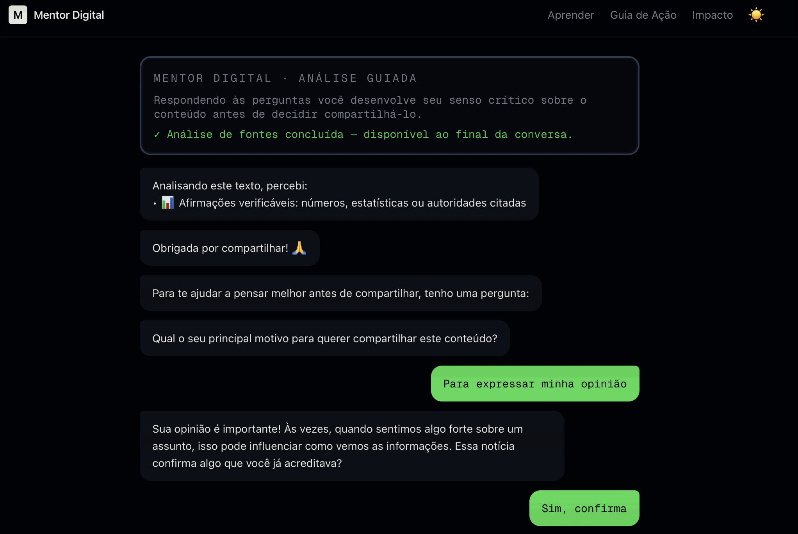
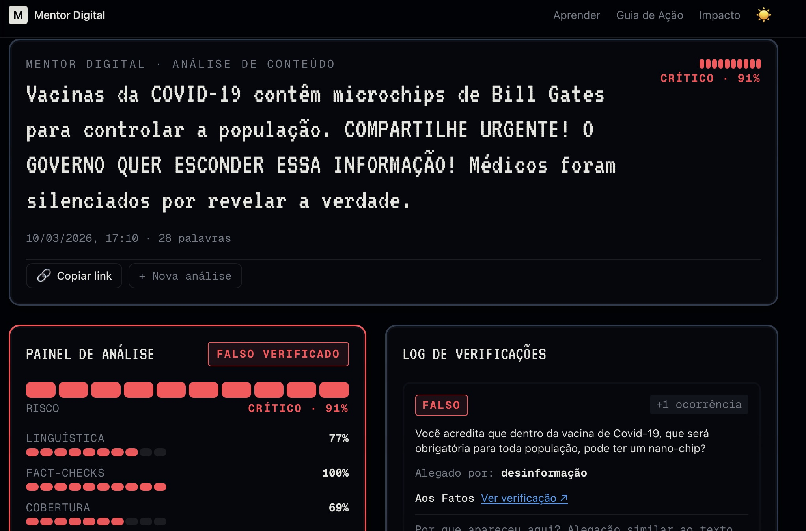
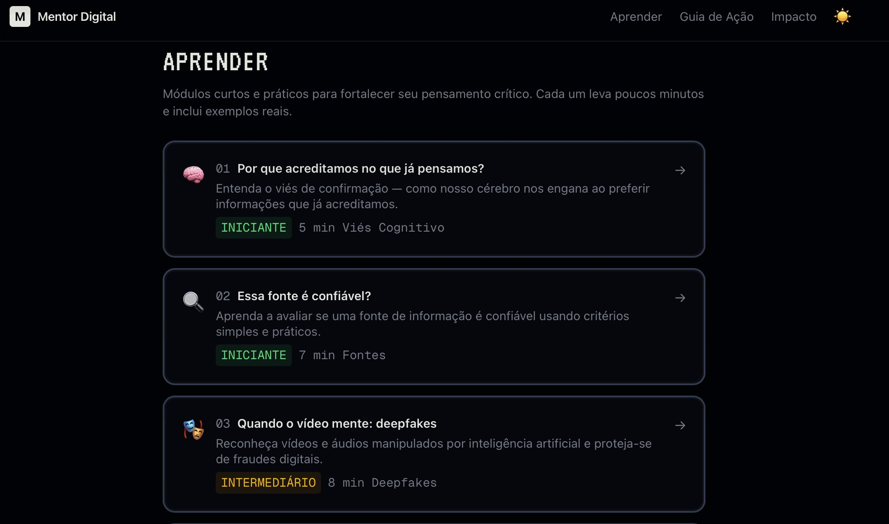
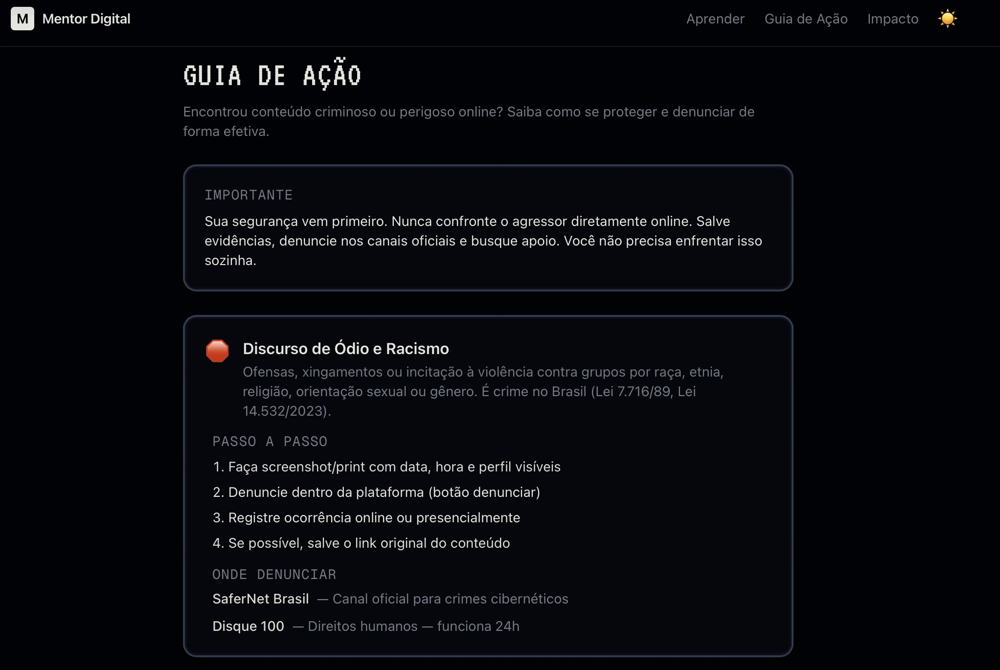

# 🛡️ Mentor Digital — Agente de Detecção de Fake News

> **Mentor Digital** é uma plataforma inteligente que ajuda usuários a desenvolver pensamento crítico sobre informações que recebem online. Em vez de simplesmente rotular conteúdo como "verdadeiro" ou "falso", o sistema guia o usuário por uma jornada de reflexão, usando análise multi-fonte em tempo real.

<p align="center">
  
</p>

---

## 📑 Índice

- [Visão Geral](#-visão-geral)
- [Screenshots](#-screenshots)
- [Arquitetura](#-arquitetura)
- [Pipeline de Análise](#-pipeline-de-análise)
- [Tecnologias](#-tecnologias)
- [Pré-requisitos](#-pré-requisitos)
- [Instalação e Execução](#-instalação-e-execução)
- [Variáveis de Ambiente](#-variáveis-de-ambiente)
- [Testes](#-testes)
- [Deploy em Produção](#-deploy-em-produção)
- [Estrutura do Projeto](#-estrutura-do-projeto)
- [Endpoints da API](#-endpoints-da-api)
- [Funcionalidades Exclusivas](#-funcionalidades-exclusivas)
- [Licença](#-licença)

---

## 🔍 Visão Geral

O Mentor Digital analisa textos e links suspeitos cruzando **7 fontes em paralelo**, gerando um score de risco multidimensional. O diferencial é a abordagem pedagógica: o sistema nunca diz "isso é fake" — ele apresenta evidências e guia o usuário a tirar suas próprias conclusões.

### Principais Características

| Recurso | Descrição |
|---------|-----------|
| **Análise Multi-Fonte** | 7 analisadores rodando em paralelo (Google Fact Check, GDELT, NewsAPI, Google News, Wikipedia, fact-checkers brasileiros, análise de domínio) |
| **NLP Baseado em Regras** | 124+ regras regex em 4 idiomas (PT, EN, ES, FR) para detectar urgência, manipulação e densidade de claims |
| **Chatbot Socrático** | FSM com 30+ estados que guia reflexão sem impor julgamentos |
| **Multi-Plataforma** | WhatsApp, Telegram e Web (PWA) |
| **LGPD-Compliant** | Dados pseudonimizados, sem PII armazenado |
| **Score Multidimensional** | Linguística, Fact-checks, Cobertura Midiática e Confiança |
| **Módulos Educativos** | Aprenda sobre viés cognitivo, deepfakes, direitos digitais |
| **Guia de Ação** | Canais de denúncia para conteúdo criminoso (SaferNet, Disque 100) |

---

## 📸 Screenshots

### Página Principal — Formulário de Análise
<p align="center">
  
</p>

### Resultado da Análise — Score de Risco
<p align="center">
  
</p>

<p align="center">
  
</p>

### Módulos de Aprendizagem
<p align="center">
  
</p>

### Guia de Ação — Denúncias
<p align="center">
  
</p>

---

## 🏗️ Arquitetura

```
┌─────────────────────────────────────────────────────────────────┐
│                        CLIENTES                                 │
│   WhatsApp ──┐                                                  │
│   Telegram ──┼──▶ Webhooks (FastAPI)                            │
│   Web (PWA) ─┘         │                                        │
│                        ▼                                        │
│              ┌─── Gateway ───┐                                  │
│              │  Rate Limit   │                                  │
│              │  Sanitização  │                                  │
│              │  Roteamento   │                                  │
│              └───────┬───────┘                                  │
│                      ▼                                          │
│         ┌──── Orquestração ────┐                                │
│         │  Session Manager     │◀──── Redis (estado + cache)    │
│         │  FSM (questioning)   │                                │
│         └──────────┬───────────┘                                │
│                    ▼                                            │
│     ┌────── Análise Paralela ──────┐                            │
│     │                              │                            │
│     │  ┌── NLP Local (<5ms) ──┐    │                            │
│     │  │  Urgência            │    │                            │
│     │  │  Manipulação         │    │                            │
│     │  │  Claims              │    │                            │
│     │  └──────────────────────┘    │                            │
│     │                              │                            │
│     │  ┌── APIs Externas ─────┐    │                            │
│     │  │  Google Fact Check   │    │                            │
│     │  │  GDELT v2            │    │                            │
│     │  │  Google News RSS     │    │                            │
│     │  │  NewsAPI             │    │                            │
│     │  │  Wikipedia PT+EN     │    │                            │
│     │  │  FC Brasileiros      │    │                            │
│     │  │  Análise de Domínio  │    │                            │
│     │  └──────────────────────┘    │                            │
│     │                              │                            │
│     └──────────┬───────────────────┘                            │
│                ▼                                                │
│     ┌── Scoring Engine ──┐                                      │
│     │  Ponderação multi- │                                      │
│     │  dimensional com   │──▶ Score Final + Nível de Risco      │
│     │  pisos progressivos│                                      │
│     └────────────────────┘                                      │
│                                                                 │
│     ┌── Persistência ────┐                                      │
│     │  Redis (sessões)   │                                      │
│     │  SQLite/PostgreSQL │                                      │
│     └────────────────────┘                                      │
└─────────────────────────────────────────────────────────────────┘
```

---

## 🔬 Pipeline de Análise

Quando um usuário submete um texto ou link, o sistema executa:

1. **Detecção de Tipo** — Identifica se é texto puro, link, imagem, vídeo, áudio ou documento
2. **NLP Local** — 124+ regras regex analisam urgência, manipulação e claims (< 5ms)
3. **Extração de Query** — Gera queries otimizadas para busca nas APIs
4. **7 Análises em Paralelo** (`asyncio.gather`):
   - Google Fact Check API (PT + EN)
   - GDELT DOC API (PT + EN)
   - Google News RSS (PT + EN)
   - NewsAPI.org (internacional)
   - Wikipedia (PT + EN)
   - Fact-checkers Brasileiros (Lupa, Aos Fatos, Comprova, E-Farsas — via RSS)
   - Análise de Domínio (RDAP, VirusTotal, urlscan.io, PageRank)
5. **Scoring Multidimensional**:
   - Com fact-checks: `overall = linguística×0.25 + factcheck×0.65 + (1−cobertura)×0.10`
   - Sem fact-checks: `overall = linguística×0.55 + claim_penalty×0.15 + (1−cobertura)×0.30`
   - Pisos progressivos quando múltiplos vereditos "falso" encontrados (0.75 → 0.90+)

### Níveis de Risco

| Nível | Score | Descrição |
|-------|-------|-----------|
| 🟢 BAIXO | 0 – 0.35 | Sem sinais significativos de desinformação |
| 🟡 MODERADO | 0.35 – 0.65 | Alguns sinais detectados, cautela recomendada |
| 🟠 ALTO | 0.65 – 0.85 | Fortes indicadores de conteúdo problemático |
| 🔴 CRÍTICO | 0.85+ | Múltiplas fontes confirmam desinformação |

---

## 🛠️ Tecnologias

### Backend
| Tecnologia | Versão | Uso |
|------------|--------|-----|
| Python | 3.12 | Linguagem principal |
| FastAPI | 0.115 | Framework web / API REST |
| Uvicorn | 0.34 | Servidor ASGI |
| Redis | 5.2 | Sessões, cache de análises |
| SQLAlchemy | 2.0 | ORM para persistência |
| httpx | 0.28 | Cliente HTTP assíncrono |
| transitions | 0.9 | Máquina de estados (FSM) |
| slowapi | 0.1 | Rate limiting |
| PyYAML | 6.0 | Configuração de fluxos |

### Frontend
| Tecnologia | Versão | Uso |
|------------|--------|-----|
| Next.js | 16.1 | Framework React (App Router) |
| React | 19.2 | UI Library |
| TypeScript | 5 | Tipagem estática |
| Tailwind CSS | 4 | Estilização |
| Radix UI | 1.4 | Componentes acessíveis |
| shadcn/ui | — | Design system |

---

## 📋 Pré-requisitos

- **Python 3.12+**
- **Node.js 20+** e **npm**
- **Redis** (local ou via Docker)

### Instalando Redis

```bash
# macOS
brew install redis && brew services start redis

# Ubuntu/Debian
sudo apt install redis-server && sudo systemctl start redis

# Docker
docker run -d -p 6379:6379 redis:7-alpine
```

---

## 🚀 Instalação e Execução

### 1. Clone o repositório

```bash
git clone https://github.com/seu-usuario/fake_news_detector.git
cd fake_news_detector
```

### 2. Backend (FastAPI)

```bash
cd apps/bot

# Criar ambiente virtual
python -m venv venv
source venv/bin/activate  # macOS/Linux

# Instalar dependências
pip install -r requirements.txt

# Configurar variáveis de ambiente
cp .env.example .env
# Edite o .env com suas chaves (veja seção "Variáveis de Ambiente")

# Rodar o servidor (porta 10000)
uvicorn src.main:app --host 0.0.0.0 --port 10000 --reload
```

O backend estará disponível em `http://localhost:10000`.
Verifique com: `curl http://localhost:10000/health`

### 3. Frontend (Next.js)

```bash
cd apps/web

# Instalar dependências
npm install

# Configurar variáveis de ambiente
echo "NEXT_PUBLIC_BOT_API_URL=http://127.0.0.1:10000" > .env.local

# Rodar o servidor de desenvolvimento
npm run dev
```

O frontend estará disponível em `http://localhost:3000`.

### 4. Executando tudo junto

Em dois terminais separados:

```bash
# Terminal 1 — Backend
cd apps/bot && source venv/bin/activate && uvicorn src.main:app --port 10000 --reload

# Terminal 2 — Frontend
cd apps/web && npm run dev
```

---

## 🔐 Variáveis de Ambiente

Copie o arquivo de exemplo e preencha com suas chaves:

```bash
cp apps/bot/.env.example apps/bot/.env
```

| Variável | Obrigatória | Descrição |
|----------|:-----------:|-----------|
| `PSEUDONYMIZATION_PEPPER` | ✅ | String aleatória para hash de IDs (LGPD) |
| `ANALYTICS_PEPPER` | ✅ | String aleatória para analytics pseudonimizados |
| `REDIS_URL` | ✅ | URL do Redis (padrão: `redis://localhost:6379/0`) |
| `GOOGLE_API_KEY` | ⚠️ | Chave da API Google Fact Check Tools — [obter aqui](https://console.cloud.google.com/) |
| `TELEGRAM_BOT_TOKEN` | ❌ | Token do BotFather (necessário apenas para integração Telegram) |
| `WEBHOOK_SECRET` | ❌ | Segredo HMAC para validar webhooks |
| `NEWSAPI_KEY` | ❌ | Chave da NewsAPI.org — [obter aqui](https://newsapi.org/) |
| `WHATSAPP_VERIFY_TOKEN` | ❌ | Token de verificação WhatsApp Cloud API |
| `WHATSAPP_APP_SECRET` | ❌ | Secret do app Meta |
| `WHATSAPP_PHONE_NUMBER_ID` | ❌ | ID do número WhatsApp Business |
| `WHATSAPP_ACCESS_TOKEN` | ❌ | Access token Meta |
| `WEB_PLATFORM_URL` | ❌ | URL do frontend (padrão: `http://localhost:3001`) |
| `ENVIRONMENT` | ❌ | `development` ou `production` |

> ⚠️ **IMPORTANTE**: Nunca commite o arquivo `.env`. Ele já está no `.gitignore`.

> **Nota**: O sistema funciona sem `GOOGLE_API_KEY` e `NEWSAPI_KEY`, mas a análise será mais limitada (sem fact-checks do Google e sem NewsAPI).

---

## 🧪 Testes

O projeto possui **21 arquivos de teste** cobrindo todos os módulos:

```bash
cd apps/bot

# Rodar todos os testes
pytest

# Rodar com verbose
pytest -v

# Rodar teste específico
pytest tests/test_nlp.py -v

# Rodar com cobertura
pytest --cov=src tests/
```

### Cobertura de Testes

| Módulo | Arquivo de Teste |
|--------|-----------------|
| NLP (regras) | `test_nlp.py` |
| Fact Check API | `test_fact_checker.py` |
| GDELT / News | `test_gdelt.py`, `test_google_news.py`, `test_newsapi.py` |
| Wikipedia | `test_nlp.py` (integrado) |
| Domínio | `test_domain_checker.py` |
| Pipeline completo | `test_analysis_service.py` |
| FSM | `test_fsm.py` |
| Endpoints | `test_analysis_endpoint.py` |
| E2E | `test_e2e_flow.py` |
| Telegram | `test_telegram.py` |
| WhatsApp | `test_whatsapp.py` |
| Sessões | `test_session_manager.py` |
| Database | `test_database.py` |
| Segurança | `test_security.py` |
| Analytics | `test_analytics.py` |

Os testes usam **fakeredis** (mock do Redis) e **unittest.mock** para APIs externas — nenhuma chave real é necessária para rodar os testes.

---

## 🌐 Deploy em Produção

### Backend — Railway / Render

O backend inclui um `Dockerfile` multi-stage otimizado:

```bash
# Build e deploy via Railway
railway up

# Ou via Render (conectar repositório GitHub)
# Root Directory: apps/bot
# Build Command: docker build
# Health Check: /health
```

### Frontend — Vercel

```bash
# Via Vercel CLI
cd apps/web && vercel

# Ou conectar o repositório GitHub no Vercel Dashboard
# Framework Preset: Next.js
# Root Directory: apps/web
```

### Variáveis em Produção

No Railway/Render, configure todas as variáveis do `.env.example`.
No Vercel, configure:
- `NEXT_PUBLIC_BOT_API_URL` — URL pública do backend

### Registrar Webhooks (após deploy do backend)

```bash
# Telegram
python apps/bot/scripts/register_telegram_webhook.py

# WhatsApp — configurar no Meta Developer Portal
```

---

## 📁 Estrutura do Projeto

```
fake_news_detector/
├── apps/
│   ├── bot/                          # Backend (Python/FastAPI)
│   │   ├── src/
│   │   │   ├── main.py               # Entry point, rotas FastAPI
│   │   │   ├── config.py             # Configuração centralizada
│   │   │   ├── models.py             # Modelos Pydantic
│   │   │   ├── content_detector.py   # Detecção de tipo de conteúdo
│   │   │   ├── session_manager.py    # Gerenciamento de sessões Redis
│   │   │   ├── security.py           # Pseudonimização LGPD
│   │   │   ├── analytics.py          # Métricas anonimizadas
│   │   │   ├── analysis/
│   │   │   │   ├── analysis_service.py  # Orquestrador principal
│   │   │   │   ├── nlp.py              # 124+ regras regex
│   │   │   │   ├── scoring.py          # Algoritmo de scoring
│   │   │   │   ├── fact_checker.py     # Google FC API
│   │   │   │   ├── gdelt_client.py     # GDELT + Google News + NewsAPI
│   │   │   │   ├── wikipedia_api.py    # Wikipedia PT+EN
│   │   │   │   ├── brazilian_fc.py     # Lupa, Aos Fatos, etc.
│   │   │   │   ├── domain_checker.py   # RDAP, VirusTotal, urlscan
│   │   │   │   └── source_registry.yaml # Registro de fontes IFCN
│   │   │   ├── engine/
│   │   │   │   ├── fsm.py             # Máquina de estados
│   │   │   │   └── flows/
│   │   │   │       └── questioning.yaml # 30+ estados do chatbot
│   │   │   ├── database/
│   │   │   │   ├── models.py          # 5 tabelas SQLAlchemy
│   │   │   │   └── repository.py      # CRUD operations
│   │   │   └── webhooks/
│   │   │       ├── telegram.py        # Handler Telegram
│   │   │       └── whatsapp.py        # Handler WhatsApp
│   │   ├── tests/                     # 21 arquivos de teste
│   │   ├── Dockerfile                 # Multi-stage build
│   │   ├── requirements.txt
│   │   └── .env.example               # Template de variáveis
│   │
│   └── web/                           # Frontend (Next.js 16)
│       ├── app/
│       │   ├── page.tsx               # Página principal + formulário
│       │   ├── analise/               # Resultados da análise
│       │   ├── aprender/              # Módulos educativos
│       │   ├── guia-acao/             # Guia de denúncias
│       │   ├── conversa/              # Chat com o mentor
│       │   ├── balanca/               # Balança de evidências
│       │   └── analytics/             # Dashboard de métricas
│       ├── components/                # UI components (shadcn)
│       └── lib/
│           ├── api.ts                 # Cliente da API
│           └── utils.ts               # Utilitários
│
├── docs/
│   └── images/                        # Screenshots para documentação
│
├── vercel.json                        # Config Vercel
└── .gitignore
```

---

## 📡 Endpoints da API

| Método | Endpoint | Rate Limit | Descrição |
|--------|----------|-----------|-----------|
| `GET` | `/health` | — | Health check |
| `POST` | `/analyze` | 10/min | Submeter conteúdo para análise |
| `GET` | `/analysis/{content_id}` | 60/min | Buscar resultado por ID |
| `POST` | `/chat/start` | 5/min | Iniciar conversa com o mentor |
| `POST` | `/chat/reply/{session_id}` | 30/min | Enviar resposta na conversa |
| `GET` | `/chat/{session_id}/status` | — | Verificar status da análise |

### Exemplo de uso

```bash
# Submeter texto para análise
curl -X POST http://localhost:10000/analyze \
  -H "Content-Type: application/json" \
  -d '{"content": "URGENTE! Compartilhe antes que deletem!"}'

# Buscar resultado
curl http://localhost:10000/analysis/{content_id}
```

---

## ✨ Funcionalidades Exclusivas

### 📚 Módulos de Aprendizagem (`/aprender`)

Cinco módulos interativos que ensinam o usuário a se proteger:

1. **Viés Cognitivo** — Entenda como seu cérebro pode enganá-lo
2. **Fontes Confiáveis** — Aprenda a avaliar a credibilidade de uma fonte
3. **Deepfakes** — Reconheça manipulação de imagem, vídeo e áudio
4. **Algoritmos** — Como redes sociais selecionam o que você vê
5. **Direitos Digitais** — Seus direitos na era da informação

### 🚨 Guia de Ação (`/guia-acao`)

Canal direto para denúncia de conteúdo criminoso:

- **Discurso de ódio** — SaferNet Brasil
- **Ameaças e violência** — Delegacia eletrônica
- **Violência contra a mulher** — Ligue 180
- **Exploração infantil** — Disque 100
- **Desinformação perigosa** — Canais de verificação IFCN

### 🤖 Chatbot Socrático

O FSM guia 30+ estados de reflexão:
- Nunca usa: "falso", "fake", "mentira"
- Mensagens de até 300 caracteres (otimizado para WhatsApp)
- Máximo 8 interações por sessão
- Botões de opção (sem texto livre)

---

## 📄 Licença

Este projeto foi desenvolvido como trabalho acadêmico para o curso **Impulso AI**.

---

<p align="center">
  <b>Mentor Digital</b> — Não apenas detecta. Ensina e protege. 🛡️
</p>
